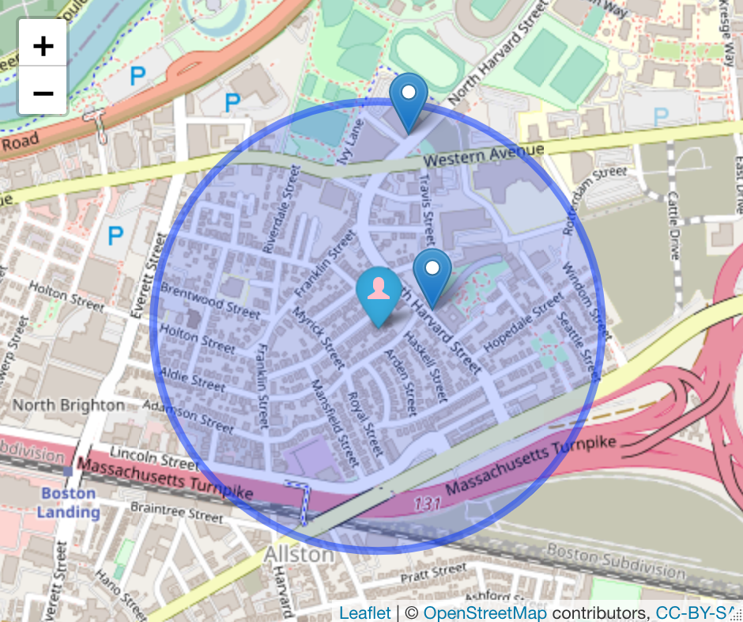

<!-- README.md is generated from README.Rmd. Please edit that file -->

# bluebike R package 

<!-- badges: start -->

[](https://lifecycle.r-lib.org/articles/stages.html#experimental)

[](https://github.com/zyang2k/bluebike/actions)

<!-- badges: end -->

## Summary

Our package includes data from the Boston Blue Bike trip history data
acquired from the [Blue Bikes System
Data](https://www.bluebikes.com/system-data). The users can import all
monthly trip history data from 2020 to 2022 into a cleaned data set that
can easily be used for data analysis.  

The package also includes a sample data set that includes 1000 sampled
trip history from Feb. 2022, and a full data set that contains
information about all available stations. Functions inside the
package:  

-   `import_month_data`: takes in numeric year/month values and imports
    data for the specified time  

-   `station_distance`: returns stations with distance in ascending
    order given the user’s current location  

-   `station_radius`: plots the position of the stations within walking
    distance (500 m), and present the basic information about the
    stations via leaflet  

-   `trip_distance`: computes the geographical distance between the
    start and end stations 

The package would be a useful tool for the Blue Bike operations to
analyze the trip data and help improve the shared bike service based on
user data. It is also an easy-to-use tool for data analysis and
visualization for anyone interested in the Blue Bike trip data.

## Installation

You can install the development version of bluebike from
[GitHub](https://github.com/zyang2k/bluebike) with:

``` r
# install.packages("devtools")
devtools::install_github("zyang2k/bluebike")
```

## Data Sets Included

-   `trip_history_sample`: a sample of 1000 trip data entries from
    February 2022.
-   `station_data`: A dataset that includes identification, position,
    and other basic information about bluebike stations

## Basic Usage

### Data Wrangling

Count the number of trips from starting stations:

``` r
library(bluebike)
library(dplyr)

stations <- trip_history_sample %>% 
  group_by(start_station_name) %>% 
  summarize(trips_from = n())
head(stations)
#> # A tibble: 6 × 2
#>   start_station_name                        trips_from
#>   <chr>                                          <int>
#> 1 175 N Harvard St                                   8
#> 2 191 Beacon St                                      3
#> 3 30 Dane St                                         7
#> 4 359 Broadway - Broadway at Fayette Street          4
#> 5 606 American Legion Hwy at Canterbury St           1
#> 6 699 Mt Auburn St                                   5
```

### Data Visualization via Leaflet

Display the position of the starting stations:


``` r
library(leaflet)

BostonMap <- leaflet(data = trip_history_sample) %>% 
  addTiles() %>% 
  addCircleMarkers(lng = trip_history_sample$start_station_longitude, 
                   lat = trip_history_sample$start_station_latitude, 
                   radius = 0.1, 
                   color = "blue")

BostonMap
```

What if I want to see the trip data of Jan. 2015?

``` r
jan2015 <- import_month_data(2015, 1)
#> Rows: 7840 Columns: 15
#> ── Column specification ────────────────────────────────────────────────────────
#> Delimiter: ","
#> chr  (4): start station name, end station name, usertype, birth year
#> dbl  (9): tripduration, start station id, start station latitude, start stat...
#> dttm (2): starttime, stoptime
#> 
#> ℹ Use `spec()` to retrieve the full column specification for this data.
#> ℹ Specify the column types or set `show_col_types = FALSE` to quiet this message.
```

We can then compute the the average distance that user traveled in
Jan. 2015

``` r
jan_distance <- jan2015 %>% 
  sample_n(1000) %>% 
  trip_distance()
mean_jan_distance <- mean(jan_distance$distance)
mean_jan_distance
#> 3215.401 [m]
```

Where can I find the closest station?

``` r
top_5_station <- station_distance(-71.13, 42.36) %>%
  head(5)

top_5_station
#>         distance station_ID                                   station_name
#> 210 124.9942 [m]     A32040                                  Honan Library
#> 3   427.6489 [m]     A32019                               175 N Harvard St
#> 221 606.1752 [m]     A32011 Innovation Lab - 125 Western Ave at Batten Way
#> 74  660.5163 [m]     A32005               Brighton Mills - 370 Western Ave
#> 380 954.2026 [m]     A32001    Union Square - Brighton Ave at Cambridge St
#>               station_position docks
#> 210 POINT (-71.12852 42.36027)    15
#> 3    POINT (-71.12916 42.3638)    18
#> 221  POINT (-71.1246 42.36371)    19
#> 74  POINT (-71.13776 42.36155)    15
#> 380 POINT (-71.13731 42.35333)    19
```

I would like to find all stations around me within 500 m, what should I
do?



``` r
station_500 <- station_radius(-71.13, 42.36, r = 500)

station_500
```

## Contributors

-   [Ziyue Yang](https://github.com/zyang2k)
-   [Tianshu Zhang](https://github.com/tianshu-zhang)
